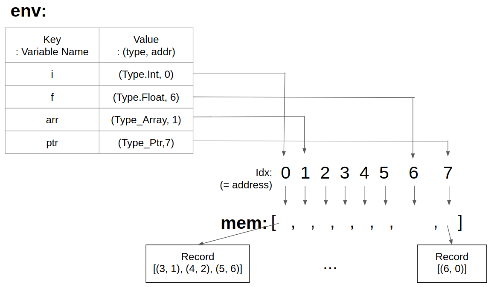
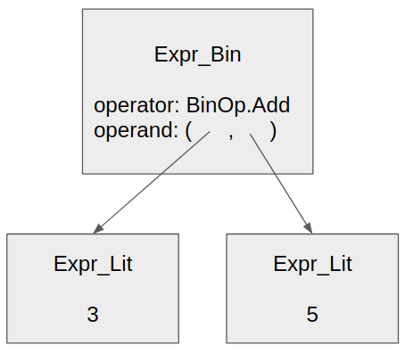
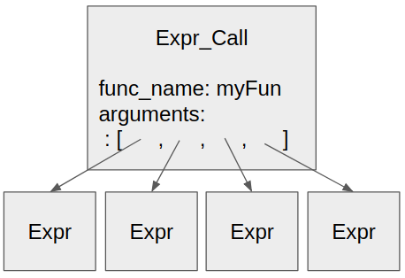
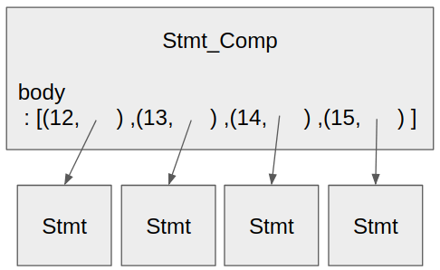
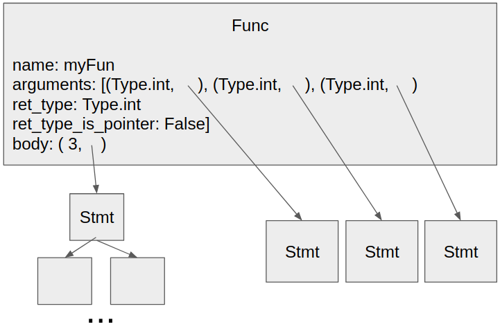

## Internal Data Structure

### Context

- env : dict으로 현재 접근할 수 있는 variable 이름과 (type, address) 맵핑한 정보 저장
- mem : variable의 값을 Record class(= (수정된 line number, 값)의 list)로 저장

### AST Node

- DecoratedName
  - name: 변수 이름
  - decorator: False(decoration 없음) || True(포인터) || 배열 길이
  
- Expr_Var
  - 변수 이름
  
- Expr_Lit
  - 값
  
- Expr_Bin
  - operator: +, -, *, /, %, ==, !=, <, <=, >, >=, =(assign), &&, ||, 배열 index
  - operand: 계산될 Expr 2개를 tuple로 저장
  - ex)
  
  
- Expr_Un
  - operator: ++, --, *(포인터), &(포인터)
  - operand: 적용될 Expr

- Expr_Call
  - func_name: call할 함수 이름
  - arguments: 인자들을 List로 저장
  - ex)
  

- Stmt_Comp
  - body: 나열되어있는 Stmt들을 (line 번호, stmt)의 List로 저장
  - ex)
  

- Stmt_For
  - 'for ( init; cond; loop) body' 를 아래 형식으로 저장
  - init:, cond:, loop:, body:(line 번호, Stmt)

- Stmt_If
  - 'if (cond) body' 를 아래 형식으로 저장
  - cond:, body: (line 번호, Stmt)

- Stmt_Decl
  - basetype:	names: DecoratedName들을 list로 저장
  - ex) int i, j; -> basetype: Type.Int, names: i, j를 저장하는 DecoratedName class

- Stmt_Return
  - retval: 리턴되는 값 저장

- Stmt_Expr
  - expr: Expr 중에 하나를 저장
  
- Stmt_Break : break; 를 뜻함
- Stmt_Cont	 : continue; 를 뜻함
- Stmt_Mpty : 빈 statement

- Func
  - ‘ret_type name(arguments) body' 를 아래형식으로 저장
  - name: 함수 이름
  - arguments: (type, DecoratedName)을 list로 저장
  - ret_type: return type
  - ret_type_is_pointer: return type이 포인터인지 표시
  - body: line 번호와 함수 body
  - ex)
  
